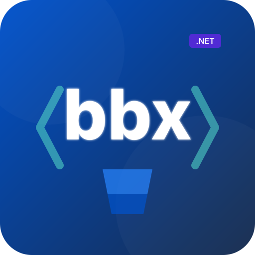

<div align="center">
  
  <h1>solrevdev.bbx</h1>
  <p><strong><code>gh</code> for Bitbucket Cloud.</strong> A .NET global tool that puts the Bitbucket Cloud API v2 on your command line, with JSON on stdout so scripts and LLMs can read it.</p>
  <p>
    <a href="https://www.nuget.org/packages/solrevdev.bbx"></a>
    <a href="https://www.nuget.org/packages/solrevdev.bbx"></a>
    
    
  </p>
</div>

---

## Contents

- [Why bbx](#why-bbx)
- [Install](#install)
- [Authenticate](#authenticate)
- [Quick start](#quick-start)
- [Output contract](#output-contract)
- [Command reference](#command-reference)
- [Recipes](#recipes)
- [Using bbx with an LLM](#using-bbx-with-an-llm)
- [Troubleshooting](#troubleshooting)
- [Build from source](#build-from-source)
- [Contributing](#contributing)
- [License](#license)

## Why bbx

Bitbucket has no first-party CLI. `bbx` fills that gap the way `gh` does for GitHub:

- **JSON on stdout, diagnostics on stderr.** Pipe straight into `jq` without filtering noise.
- **Exit codes that mean something.** `0` on success, `1` on any failure, so `set -e` and `if !` work.
- **One credential.** An Atlassian API token, stored `0600`, with scopes you choose.
- **Wide coverage.** Repos, pull requests, branches, tags, commits, source files, downloads, pipelines, snippets, workspaces, projects and users.
- **Errors you can act on.** A missing scope tells you which scope and where to re-issue the token.

## Install

```bash
dotnet tool install -g solrevdev.bbx
```

Upgrade or remove:

```bash
dotnet tool update -g solrevdev.bbx
dotnet tool uninstall -g solrevdev.bbx
```

Requires the [.NET SDK](https://dotnet.microsoft.com/download) 8, 9 or 10. If `bbx` isn't found afterwards, add the tools directory to your `PATH`:

```bash
export PATH="$PATH:$HOME/.dotnet/tools"
```

## Authenticate

`bbx` uses **Atlassian API tokens**. Create one at
**<https://bitbucket.org/account/settings/api-tokens/>**, then:

```bash
bbx auth login
```

It prompts for your Atlassian account email and the token, checks them against
`/2.0/user`, and saves them to `~/.config/bbx/config.json` with mode `0600`.

Set a default workspace so you can drop `-w` from every command:

```bash
bbx auth set-workspace myworkspace
bbx auth status
```

### Scopes

Pick scopes when you create the token. Grant the least you need:

| Doing this | Needs |
| --- | --- |
| Read repos, PRs, commits, pipelines | `read:*` for the areas you use |
| Create PRs, push files, comment | `write` on repository / pullrequest |
| Deploy keys, branch restrictions, branching-model settings, repo create/delete | `admin:repository` |
| Pipeline variables and schedules | `admin:pipeline` |

A token missing a scope gets a 403 that names the gap:

```console
$ bbx repo deploy-keys list -w myworkspace -r myrepo
Error: Your credentials lack one or more required privilege scopes. (HTTP 403 Forbidden)
Missing token scopes: admin:repository:bitbucket. Re-issue your token with those
scopes at https://bitbucket.org/account/settings/api-tokens/
```

### In CI

Write the config file directly — no prompting:

```yaml
- name: Configure bbx
  run: |
    mkdir -p ~/.config/bbx
    cat > ~/.config/bbx/config.json <<'JSON'
    { "AuthMethod": "api-token",
      "Username": "${{ secrets.BITBUCKET_EMAIL }}",
      "ApiToken": "${{ secrets.BITBUCKET_API_TOKEN }}",
      "DefaultWorkspace": "myworkspace" }
    JSON
    chmod 600 ~/.config/bbx/config.json
```

Set `BBX_NO_INTERACTIVE=1` to be certain `bbx` never tries to prompt. Without a
TTY it won't anyway, but the variable makes the intent explicit.

## Quick start

```bash
bbx repo list -w myworkspace --limit 10
bbx pr list -w myworkspace -r myrepo --state OPEN
bbx pr view 42 -w myworkspace -r myrepo
bbx pr diff 42 -w myworkspace -r myrepo
bbx pipeline list -w myworkspace -r myrepo --limit 5
```

With a default workspace set, `-w` is optional:

```bash
bbx pr list -r myrepo --state OPEN
```

## Output contract

Three rules, relied on by every example below.

**1. JSON on stdout, everything else on stderr.**

```bash
bbx pr list -r myrepo --state OPEN | jq -r '.pull_requests[].title'
```

Prompts, warnings and errors go to stderr, so the pipe above stays clean.

**2. Exit `0` on success, `1` on failure** — a bad argument, missing credentials, or any API error.

```bash
if ! prs=$(bbx pr list -r myrepo --state OPEN); then
  echo "lookup failed" >&2
  exit 1
fi
```

**3. Pretty-printed by default, single-line on request.** Use `--json-compact`
or `BBX_JSON_COMPACT=1` for one object per line:

```bash
bbx repo list -w myworkspace --json-compact
```

A few commands emit raw text rather than JSON, because that is the useful form:
`pr diff`, `pr patch`, `commit diff`, `commit patch`, `src cat`.

## Command reference

Every group takes `-w`/`--workspace` and, where relevant, `-r`/`--repo`.
Destructive commands prompt unless you pass `--yes`.

<details open>
<summary><strong>auth</strong> — credentials</summary>

```bash
bbx auth login                    # prompt for email + API token
bbx auth login --email me@x.com   # prompt for just the token
bbx auth status                   # who am I, which workspace
bbx auth token                    # print email:token (for curl -u)
bbx auth set-workspace myws       # default for -w
bbx auth logout                   # clear stored credentials
```
</details>

<details>
<summary><strong>repo</strong> — repositories, hooks, deploy keys, reviewers</summary>

```bash
bbx repo list -w myws --limit 10
bbx repo view myrepo -w myws
bbx repo create myrepo -w myws --private --description "..."
bbx repo delete myrepo -w myws --yes
bbx repo fork myrepo -w myws --name myfork
bbx repo clone myrepo -w myws            # prints the clone URL
bbx repo permissions myrepo -w myws
bbx repo watchers -w myws -r myrepo
bbx repo forks list -w myws -r myrepo

bbx repo hooks list|view|create|update|delete -w myws -r myrepo
bbx repo deploy-keys list|view|add|delete -w myws -r myrepo
bbx repo default-reviewers list|add|remove|effective -w myws -r myrepo
bbx repo branching-model view|settings|update -w myws -r myrepo
```
</details>

<details>
<summary><strong>pr</strong> — pull requests, tasks, reviews</summary>

```bash
bbx pr list -w myws -r myrepo --state OPEN --limit 25
bbx pr view 42 -w myws -r myrepo
bbx pr create --title "Fix" --source feat/x --dest main -w myws -r myrepo
bbx pr merge 42 --strategy squash --yes -w myws -r myrepo
bbx pr decline 42 --reason "superseded" -w myws -r myrepo

bbx pr diff 42 -w myws -r myrepo         # raw text
bbx pr patch 42 -w myws -r myrepo        # raw text
bbx pr commits 42 -w myws -r myrepo
bbx pr activity 42 -w myws -r myrepo
bbx pr statuses 42 -w myws -r myrepo

bbx pr comment 42 --body "LGTM" -w myws -r myrepo
bbx pr comments 42 -w myws -r myrepo
bbx pr approve|unapprove 42 -w myws -r myrepo
bbx pr request-changes|unrequest-changes 42 -w myws -r myrepo
bbx pr tasks list|add|update|complete|delete 42 -w myws -r myrepo
```

Merge strategies: `merge_commit` (default), `squash`, `fast_forward`.
`merge`, `fast-forward` and `ff` are accepted as aliases.
</details>

<details>
<summary><strong>branch</strong> — branches, restrictions, tags</summary>

```bash
bbx branch list -w myws -r myrepo --limit 25
bbx branch view main -w myws -r myrepo
bbx branch create feat/x --target main -w myws -r myrepo
bbx branch delete feat/x --yes -w myws -r myrepo

bbx branch restrictions list -w myws -r myrepo
bbx branch restrictions add --kind push --pattern main -w myws -r myrepo
bbx branch restrictions delete 12345 --yes -w myws -r myrepo

bbx branch tag list|view|create|delete -w myws -r myrepo
```
</details>

<details>
<summary><strong>commit</strong> — history, diffs, build statuses</summary>

```bash
bbx commit list -w myws -r myrepo --limit 25
bbx commit view <hash> -w myws -r myrepo
bbx commit diff|patch|diffstat <hash> -w myws -r myrepo
bbx commit comments|statuses|pullrequests <hash> -w myws -r myrepo
bbx commit approve|unapprove <hash> -w myws -r myrepo
bbx commit filehistory main path/to/file -w myws -r myrepo
bbx commit merge-base 'feat/x..main' -w myws -r myrepo

bbx commit status create <hash> --key ci --state SUCCESSFUL --url https://ci/1 -w myws -r myrepo
bbx commit status update <hash> --key ci --state FAILED --url https://ci/1 -w myws -r myrepo
```
</details>

<details>
<summary><strong>src</strong> — browse and write files</summary>

```bash
bbx src ls --ref main -w myws -r myrepo
bbx src ls src/ --ref main -w myws -r myrepo
bbx src cat --ref main README.md -w myws -r myrepo
bbx src write --branch main --message "docs: update" --file ./local.md=README.md -w myws -r myrepo
```

`src write` commits directly. Repeat `--file` for several files in one commit.
</details>

<details>
<summary><strong>pipeline</strong> — runs, logs, variables, schedules</summary>

```bash
bbx pipeline list -w myws -r myrepo --limit 10
bbx pipeline view '{uuid}' -w myws -r myrepo
bbx pipeline steps '{uuid}' -w myws -r myrepo
bbx pipeline logs '{pipeline-uuid}' '{step-uuid}' -w myws -r myrepo
bbx pipeline trigger --branch main -w myws -r myrepo
bbx pipeline stop '{uuid}' --yes -w myws -r myrepo

bbx pipeline variables list|add|delete -w myws -r myrepo
bbx pipeline schedules list|create|delete -w myws -r myrepo
bbx pipeline caches list|clear -w myws -r myrepo
bbx pipeline deployments list|view -w myws -r myrepo
bbx pipeline reports list|view|annotations <hash> -w myws -r myrepo
bbx pipeline test-reports '{pipeline}' '{step}' -w myws -r myrepo
bbx pipeline test-cases '{pipeline}' '{step}' -w myws -r myrepo
bbx pipeline oidc config|keys -w myws -r myrepo
```

UUIDs include the braces. Quote them so your shell doesn't expand them.
</details>

<details>
<summary><strong>download</strong> — repository artifacts</summary>

```bash
bbx download list -w myws -r myrepo
bbx download upload --file ./build.zip -w myws -r myrepo
bbx download get build.zip --output ./build.zip -w myws -r myrepo
bbx download delete build.zip --yes -w myws -r myrepo
```
</details>

<details>
<summary><strong>workspace</strong> — members, hooks, projects</summary>

```bash
bbx workspace view myws
bbx workspace members -w myws
bbx workspace permissions -w myws
bbx workspace hooks list|view|create|update|delete -w myws

bbx workspace project list -w myws
bbx workspace project view KEY -w myws
bbx workspace project create --key KEY --name "Name" -w myws
bbx workspace project delete KEY --yes -w myws
bbx workspace project default-reviewers list|add|remove --project-key KEY -w myws
bbx workspace project deploy-keys list|view|add|delete --project-key KEY -w myws
bbx workspace project branching-model view|update --project-key KEY -w myws
```
</details>

<details>
<summary><strong>snippet</strong>, <strong>user</strong>, <strong>issue</strong></summary>

```bash
bbx snippet list|view|create|update|delete -w myws
bbx snippet files|watch|comments <id> -w myws

bbx user view                       # the authenticated account
bbx user emails
bbx user ssh-keys list|view|add|delete

bbx issue list|view|create|update|delete -w myws -r myrepo
bbx issue comment|comments <id> -w myws -r myrepo
```

> [!WARNING]
> **Bitbucket Issues are being retired by Atlassian.** The API is removed on
> **2026-08-20** and these commands go with it. See
> [docs/bitbucket-issues-wikis-sunset.md](docs/bitbucket-issues-wikis-sunset.md).
</details>

### Commands Bitbucket has withdrawn

> [!IMPORTANT]
> `bbx workspace list` and `bbx user permissions workspaces|repositories` return
> **HTTP 410 Gone**. Atlassian removed the cross-workspace discovery endpoints
> under CHANGE-2770. Nothing in `bbx` can bring them back — name the workspace,
> or set one with `bbx auth set-workspace`.

## Recipes

**Open PRs, oldest first**

```bash
bbx pr list -r myrepo --state OPEN --limit 100 \
  | jq -r '.pull_requests | sort_by(.created_on)[] | "\(.id)\t\(.title)"'
```

**Did the last pipeline pass?**

```bash
bbx pipeline list -r myrepo --limit 1 \
  | jq -r '.pipelines[0].state | "\(.name) \(.result // "")"'
```

**Read the newest pipeline's first step log**

```bash
p=$(bbx pipeline list -r myrepo --limit 1 | jq -r '.pipelines[0].uuid')
s=$(bbx pipeline steps "$p" -r myrepo | jq -r '.steps[0].uuid')
bbx pipeline logs "$p" "$s" -r myrepo | jq -r '.log'
```

**Report a build status from CI**

```bash
bbx commit status create "$COMMIT" --key ci --state INPROGRESS --url "$BUILD_URL" -r myrepo
# ... run the build ...
bbx commit status update "$COMMIT" --key ci --state SUCCESSFUL --url "$BUILD_URL" -r myrepo
```

**Commit a generated file without cloning**

```bash
bbx src write --branch main --message "chore: regenerate" --file ./out.json=data/out.json -r myrepo
```

**Every repo in the workspace, as TSV**

```bash
bbx repo list -w myws --limit 200 | jq -r '.repositories[] | [.slug, .updated_on] | @tsv'
```

## Using bbx with an LLM

Every command answers with JSON and reports failure through its exit code, so an
agent can call `bbx` and act on the result without scraping human prose. Point
your agent at **[docs/llm-guide.md](docs/llm-guide.md)** for command selection,
argument shapes and worked examples.

Two flags matter for agents:

```bash
bbx pr list -r myrepo --json-compact   # one line per response, cheaper to read
BBX_NO_INTERACTIVE=1 bbx repo list     # never prompt; fail with a clear error
```

## Troubleshooting

| Symptom | Cause and fix |
| --- | --- |
| `Not authenticated. Run: bbx auth login` | No stored credential. Log in, or write the config file directly in CI. |
| `Missing token scopes: …` | The token lacks a scope. Re-issue it at the API tokens page with that scope. |
| `HTTP 410 Gone` on `workspace list` | Atlassian withdrew the endpoint (CHANGE-2770). Name the workspace instead. |
| `Bitbucket Cloud Issues are being sunset` | A warning, not a failure. The Issues API goes away 2026-08-20. |
| `Workspace and repository are required` | Pass `-w` and `-r`, or set a default with `bbx auth set-workspace`. |
| A UUID argument "does nothing" | Quote it. `{...}` is brace expansion in bash and zsh. |

Check what `bbx` thinks it is doing:

```bash
bbx auth status
bbx <group> <command> --help
```

## Build from source

```bash
git clone <this repo> && cd solrevdev.bbx

dotnet build src/Bbx/Bbx.csproj
dotnet test tests/Bbx.Tests/Bbx.Tests.csproj

# run without installing
dotnet run --project src/Bbx/Bbx.csproj -f net10.0 -- repo list -w myws

# install your build globally
dotnet pack src/Bbx/Bbx.csproj -c Release
dotnet tool install -g --add-source ./nupkg solrevdev.bbx
```

Layout:

```
src/Bbx/
  Api/            BitbucketClient — pagination, redirects, error shaping
  Auth/           credential storage and the auth gate
  Commands/       System.CommandLine wiring only, no business logic
  Features/       one folder per verb: request + handler
  Composition/    DI container and shared JSON options
tests/Bbx.Tests/  xUnit, fake HTTP handler, no network
```

## Contributing

Issues and pull requests are welcome.

- Conventional Commits for messages (`feat:`, `fix:`, `docs:`, `refactor:`, `test:`).
- `dotnet test` must pass; new behaviour needs a test.
- Business logic belongs in `Features/`, not in `Commands/`.

## License

[MIT](LICENSE) © solrevdev
